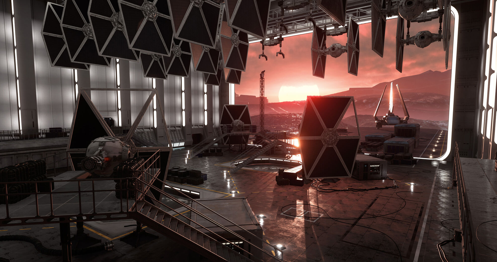
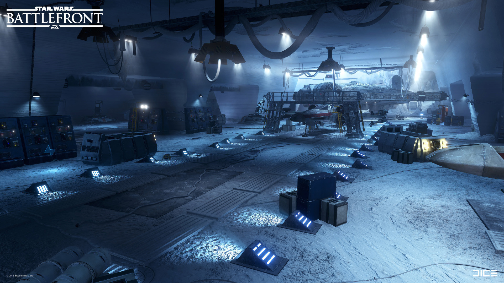
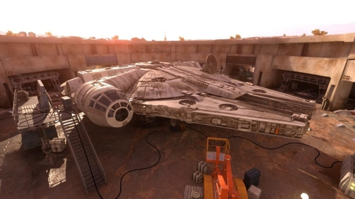

# Fastest times to deliver the cargo on each map
<i>*1 second added for safty margin</i>

### Imperial hangar = 16 sec [Click]

### Imperial station (Rebel side) = 22 sec [Click]

### Imperial station (Imperial side) = 22 secc [Click]

### Rebel base = 23 sec [Click]

### Rebel Depot = 20 sec [Click]

