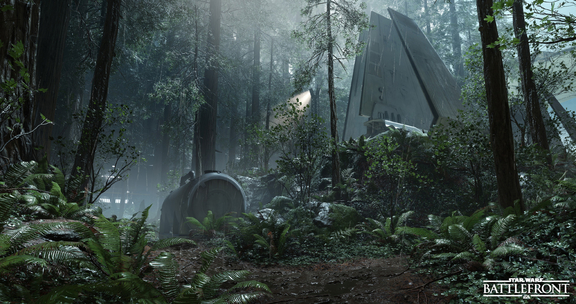

# Fastest times to deliver the cargo on each map
<i>*1 second safty margin</i>
* Imperial hangar = 16 sec
* Imperial station Rebel side = 22 sec

* Imperial side = 22 sec
* Rebel base = 23 sec
* Rebel Depot = 20 sec
